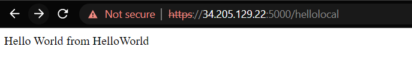
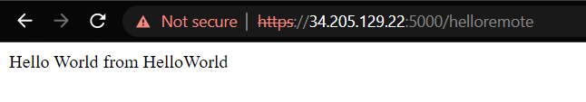
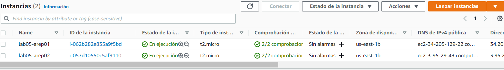

## LAB 05 
# Francisco Javier Rojas M

#### Desarrolle una aplicación Web segura con los siguientes requerimientos:

1. Debe permitir un acceso seguro desde el browser a la aplicación. Es decir debe garantizar autenticación, autorización e integridad de usuarios.

2. Debe tener al menos dos computadores comunicándose entre ellos y el acceso de servicios remotos debe garantizar: autenticación, autorización e integridad entre los servicios. Nadie puede invocar los servicios si no está autorizado.

3. Explique como escalaría su arquitectura de seguridad para incorporar nuevos servicios.
Descrito en la seccion de escalamiento de la arquitectura

#### Entregables:

1. Código en github, bien documentado.

    [EsteRepo]()

2. Informe que describe la arquitectura de seguridad de su prototipo. (en el README)

    [EsteRepo]()

3. Video de experimento en AWS

    [Video](https://youtu.be/aFT_4o7J6cc)
