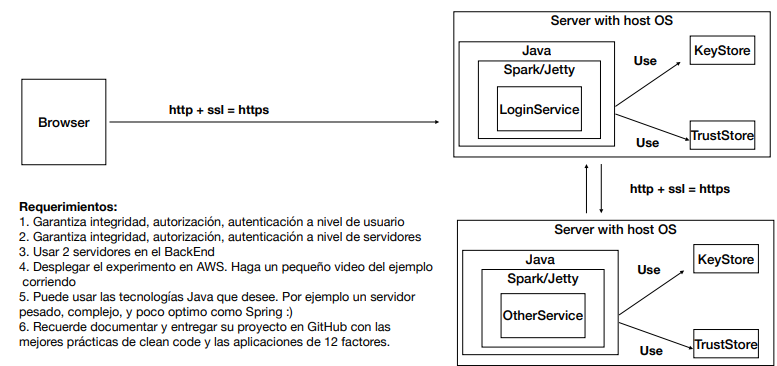
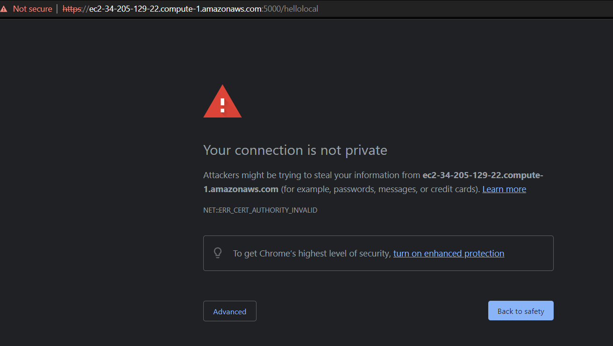
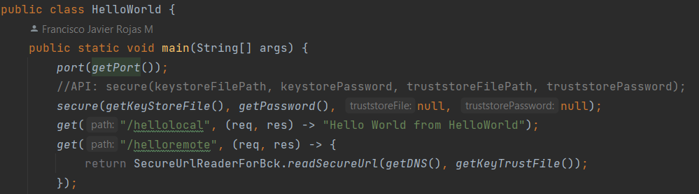
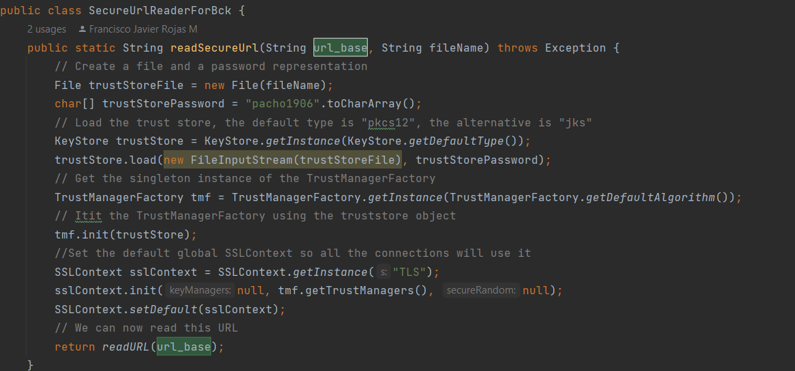
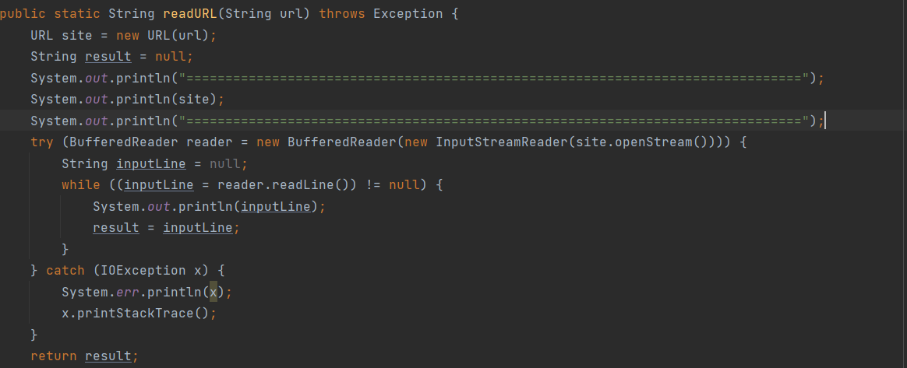
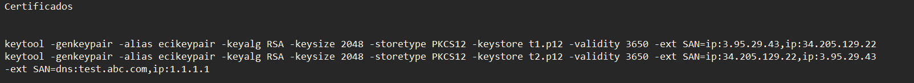
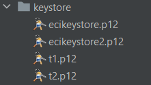
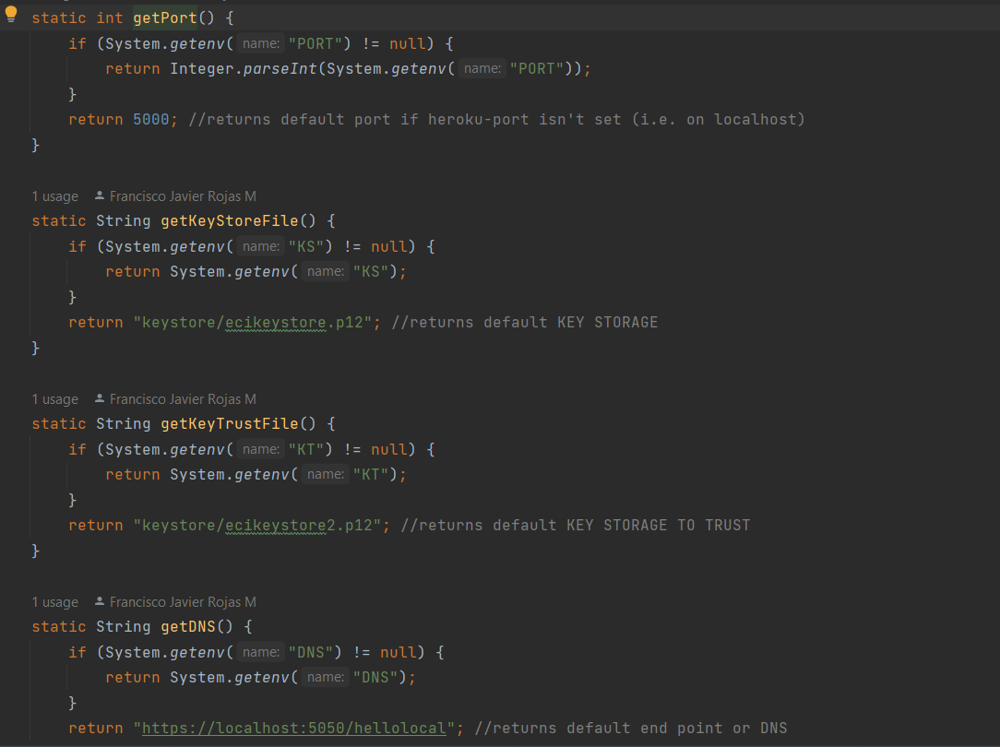
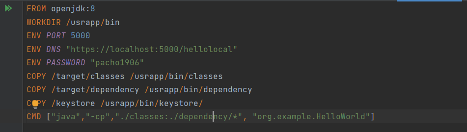
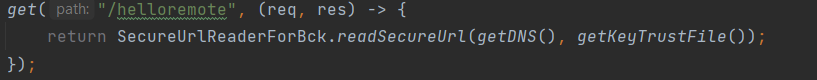

## LAB 05 
# Francisco Javier Rojas M

#### Desarrolle una aplicación Web segura con los siguientes requerimientos:

1. Debe permitir un acceso seguro desde el browser a la aplicación. Es decir debe garantizar autenticación, autorización e integridad de usuarios.

   
   

2. Debe tener al menos dos computadores comunicándose entre ellos y el acceso de servicios remotos debe garantizar: autenticación, autorización e integridad entre los servicios. Nadie puede invocar los servicios si no está autorizado.

   

3. Explique como escalaría su arquitectura de seguridad para incorporar nuevos servicios.

   Descrito en la seccion de escalamiento de la arquitectura

#### Entregables:

1. Código en github, bien documentado.

    [EsteRepo](https://github.com/javier32rojas040506/LAB05-AREP)

2. Informe que describe la arquitectura de seguridad de su prototipo. (en el README)

    [EsteRepo/Readme.md](https://github.com/javier32rojas040506/LAB05-AREP/blob/main/Readme.md)

3. Video de experimento en AWS

    [Video solo prueba](https://youtu.be/NXhoCH7N6cA)

    [Video completo](https://youtu.be/Wncxy6Z9wOc)

### Arquitectura
La arquitectura cosntruida para este laboratorio es la siguiente



#### Explicacion general
La arquitectura consiste en conectar un cliente por medio del protocolo seguros https, que es la convinacion de ssl y http
y a su vez se debe crear otro servidor que también sea accesible por https pero estos servidores deben poder conectarse
mutuamente entre si por un medio seguro como lo es https.

- ***para el browser:***
  * debemos introducir https en la direccion de manera que tendremos lo siguiente:
     

- ***para el servidor***

  * Tenemos un servidor spark con los siguinetes endpoints
  
  * El segundo enpint es el que envia una peticion al otro servidor via https. de la siguinete manera
  
  * Una vez generado una conexion con ssl, se empieza a leer el http response
  con el siguiente código
  
  * para completar la arquitectura del servidor vamos a generar el certificado para que sea posible establecer el certificado
  ssl con:
  
    ```keytool -genkeypair -alias ecikeypair -keyalg RSA -keysize 2048 -storetype PKCS12 -keystore t1.p12 -validity 3650 -ext SAN=ip:3.95.29.43,ip:34.205.129.22```
    
  
- ***para el otro servidor:***
   Se conserva el codigo pero en este caso se debe cambiar la llave
- ```keytool -genkeypair -alias ecikeypair -keyalg RSA -keysize 2048 -storetype PKCS12 -keystore t2.p12 -validity 3650 -ext SAN=ip:3.95.29.43,ip:34.205.129.22```
  
    * tenemos lo siguinete
    

- ***Variables de entorno:***
  Los servidores tienen variables de entorno para que sea ejecutable y se puedan crear diferentes instancias o servidores
    
- ***Dockerfile para servidores:***
    Aqui vamos a copiar las llaves creadas y vamos configurar variables de entorno
    ```
  FROM openjdk:8
    WORKDIR /usrapp/bin
    ENV PORT 5000
    ENV DNS "https://localhost:5000/hellolocal"
    ENV PASSWORD "pacho1906"
    COPY /target/classes /usrapp/bin/classes
    COPY /target/dependency /usrapp/bin/dependency
    COPY /keystore /usrapp/bin/keystore/
    CMD ["java","-cp","./classes:./dependency/*", "org.example.HelloWorld"]
  ```
  
- ***Levantar contenedores:***
    Para levantar los contenedores debemos inicializar las variables del PUERTO, DNS, KS y KT en el comando docker run
    ```
  sudo docker run -d -p 5000:5000 -e KT=keystore/ecikeystore2.p12 -e KS=keystore/ecikeystore.p12 -e DNS=https://192.168.3.25:5050/hellolocal secure-server
  sudo docker run -d -p 5050:5050 -e KT=keystore/ecikeystore.p12 -e KS=keystore/ecikeystore2.p12 -e DNS=https://192.168.3.25:5000/hellolocal -e PORT=5050 secure-server
  ```

#### Escalabilidad
La arquitectura actual permite agregar mas servidores siempre que puedan tener acceso a la llave en la que deben confiar. solo se
debe especificar las variables. esto gracias a que cada servidro son instacias separadas y no deben inteferir

En el caso de querer implementar otro servidor spark solo debe introducirlo en la ruta de este repositorio y especificar las variables de entorno
para que se comunique via https a otro servidor como lo muestra la imagen

en este caso getDNS especifica el endpoint del otro servidor y el trustfile es el certificado de dicho dns

Todo esto es ajustable por medio de variables de entorno como se explico en la seccion Dockerfile y Levantar contenedores de este readme
